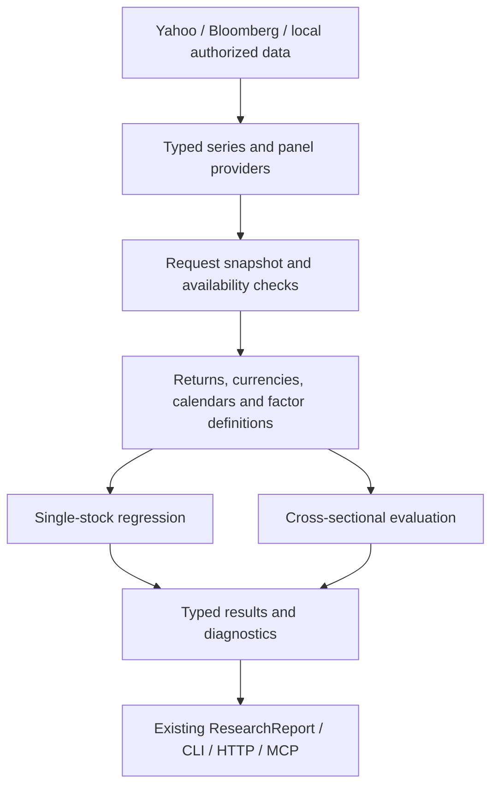

# Factor analysis framework — proposed design

3 October 2026. Status: review and implementation plan; no factor functionality has been implemented. Companion: [backend findings](backend-review-2026-10-03.md).

## Product recommendation

Build two fixed analytics workflows on the current backend:

1. **`factor-regression`:** explain an individual stock's historical returns and how its exposures change.
2. **`factor-evaluation`:** test whether a characteristic ranks future returns across a defined equity universe.

Start with U.S. and European equities, researched separately by region. Allow a later combined universe with explicit currency/country treatment. Crypto can use the same numerical engine with different calendars and factor definitions, but should be a separate initial study universe.

Use ordinary least squares with robust uncertainty as the first explanatory model. Add residualization, ridge, and PCA as explicit comparison modes. Begin with a small understandable factor set; breadth of connectors should not imply hundreds of unvalidated factors.

### Agreed engineering approach

The user prioritizes simplicity, independence, maintainability, and incremental scaling. Before each major capability, briefly review a few relevant established projects, record the useful ideas and limitations, then implement the smallest version that fits this repository. This is a short design check, not an open-ended survey or a requirement to adopt an external framework.

Own the factor definitions, data preparation, study workflow, and report contracts locally. Keep dependencies at the level of reliable numerical primitives: NumPy/pandas and statsmodels first; scikit-learn only when its functionality is shipped. Do not make Qlib, Vibe-Trading, Alphalens, or a Bloomberg wrapper mandatory runtime dependencies. Borrow ideas rather than importing their architecture. Small licensed code reuse is optional and still requires attribution and tests.

The sections below describe the eventual direction. Build only the contracts and modules consumed by the current vertical slice. MVP 1 is one stock, three explanatory variables, daily historical data, OLS/HAC, and a readable report through the existing interfaces. It has no PCA, automatic factor selection, streaming feed, new database service, custom formula language, or large factor catalogue. Correctness prerequisites are mandatory; unrelated cleanup does not gate that first useful report.

## What the two workflows mean

| Question | Input | Output | What it does not establish |
|---|---|---|---|
| “Why did this stock move?” | One stock's returns and matching historical factor series | Betas, confidence intervals, model fit, rolling exposures, residual returns | Causation or a tradable forecast |
| “Do high-momentum stocks outperform low-momentum stocks?” | Many stocks' dated momentum scores and subsequent returns | Rank IC, quantile returns, decay, turnover, regional/sector breakdowns | Executable net alpha without costs, availability, and universe controls |
| “What premium did each characteristic earn?” | Predetermined characteristics across stocks and subsequent returns, repeated by date | Cross-sectional regression slopes and time-series uncertainty | The same thing as a stock's time-series beta |

A stock's sales-growth score is a **characteristic**. A growth index's daily return is a **return series**. A company's beta to that index is an **exposure**. They need different types and labels even if all are called “factors” in conversation.

## Single-name regression

An initial explanatory model is:

```text
stock excess return[t]
  = intercept
  + market_beta × market excess return[t]
  + style_beta × (growth index return[t] - value index return[t])
  + momentum_beta × momentum active return[t]
  + error[t]
```

Here momentum active return means the selected regional momentum index return minus its parent market return. Both style spreads use matching return and currency conventions. They are transparent benchmark-relative proxies, not guaranteed beta-neutral factors. Add oil or another economically justified series as a subsequent small extension.

Excess return means total return less a matched-currency risk-free return over the same interval. For long-only ETF/index proxies, subtract the appropriate risk-free return; do not subtract it again from an already zero-investment long-short factor. If risk-free data are absent, run an explicitly labeled raw-return model and do not describe its intercept as risk-adjusted alpha.

An illustrative oil beta of `0.3` means a 1% oil move is associated with approximately 0.3 percentage points of stock return, holding included factors fixed. It does not mean oil caused the move. Report unstandardized coefficients for interpretation and standardized effects for comparison.

### Factor definitions

| Factor | Suitable starting form | Important distinction |
|---|---|---|
| Market | Matched-region broad equity total return, optionally excess | U.S. benchmark is not a universal European benchmark. |
| Momentum | Documented regional long-short momentum series; alternatively a labeled momentum ETF/index proxy | A long-only momentum fund carries market/sector exposure. |
| Growth | Documented growth-style index/proxy, with broad market included; optional residualization | “Growth” is not automatically negative HML. A market-subtracted spread is not guaranteed beta-neutral. |
| Value | Documented regional value-style index, paired with the matching growth index | Start with growth minus value as one style variable; a positive coefficient is a growth-relative tilt. Do not include the spread and both constituent returns together. |
| Oil | Specified Brent/WTI return or price change | Name spot/futures, contract, roll, currency, and unit. Nonpositive futures prices cannot be log-transformed. |
| Diesel | Clearly identified spot assessment or gasoil/futures proxy | A gasoil contract is a proxy, not identical to a regional diesel cash assessment. Use publication lag and appropriate frequency. |
| Rates / credit / FX | Yield/spread changes in basis points; FX returns with quote convention | Do not regress stock returns indiscriminately on drifting price/yield levels. |
| Sector | Matched sector index/proxy | Useful control; avoid adding every overlapping proxy simultaneously. |

The [Kenneth French data library](https://mba.tuck.dartmouth.edu/pages/faculty/ken.french/data_library.html) provides documented U.S. and regional factor datasets and methodology. Import the exact currency, frequency, units, risk-free conventions, vintage, and missing-value codes. Do not assume a “Europe” file is denominated in EUR. Research factors are not automatically investable funds or licensed for unrestricted redistribution.

### Recommended benchmark presets

Prefer actual index histories through the firm's authorized Bloomberg connection. Index selection is independent of the data provider: a canonical series definition maps to a verified Bloomberg identifier/field or to an explicitly different public proxy. The following are research defaults for large/mid-cap stocks, not investment recommendations or universal matches for every listing.

| Role | U.S. preset | European preset |
|---|---|---|
| Broad market | [MSCI USA](https://www.msci.com/indexes/index/984000/msci-usa-index) | [MSCI Europe](https://www.msci.com/indexes/index/990500/msci-europe-index) |
| Growth leg | [MSCI USA Growth](https://www.msci.com/indexes/index/105825/msci-usa-growth-index) | [MSCI Europe Growth](https://www.msci.com/indexes/index/105843) |
| Value leg | [MSCI USA Value](https://www.msci.com/documents/10199/255599/msci-usa-value-index.pdf) | [MSCI Europe Value](https://www.msci.com/www/fact-sheet/msci-europe-value-index/07347609) |
| Momentum leg | [MSCI USA Momentum](https://www.msci.com/www/fact-sheet/msci-usa-momentum-index/07827627) | [MSCI Europe Momentum](https://www.msci.com/indexes/index/703764/msci-europe-momentum-index) |

Use these inputs to construct market excess return, growth-minus-value, and momentum-minus-market. Show their correlations and explain that a positive style coefficient means the stock tended to do better when growth beat value. Market exposure remains in the model. Report the two constituent style indexes as descriptive comparisons without adding redundant regressors.

MSCI provides a consistent regional family; this is why it is the preferred first preset, not a claim that it will fit every stock best. Europe includes markets beyond the euro area, so it is not interchangeable with a eurozone benchmark. For predominantly domestic, small-cap, or unusual sector names, flag the mismatch and allow an explicit benchmark override. Add country/sector controls only when the research question calls for them. Keep a separate academic validation preset using regional Fama–French factors plus momentum later; HML is not an exact substitute for the proposed growth-minus-value index spread.

Use a consistent total-return convention and currency across all legs. Default to gross total returns where consistently available, with USD for the U.S. study and EUR for the pan-European study; convert the stock series too. If only net total returns are available, use an explicitly labeled consistent preset. Keep tax/return-convention mismatches visible. A GBP/CHF/local-currency study is an explicit alternative, not a relabeling of EUR returns. Record index launch dates, pre-launch backtested history, and material methodology changes.

For a Yahoo-only U.S. demonstration, an alternative preset can use IWB for the market, IWF minus IWD for style, and MTUM minus IWB for momentum. [IWB](https://www.ishares.com/us/products/239707/ishares-russell-1000-etf) follows Russell 1000, [IWF](https://www.ishares.com/us/products/239706/ishares-russell-1000-growth-etf) is its growth ETF, and [IWD](https://www.blackrock.com/us/individual/products/239708/ishares-russell-1000-value-etf) is its value ETF. [MTUM](https://www.ishares.com/us/products/251614/ishares-msci-usa-momentum-factor-etf) currently follows the MSCI USA Momentum **SR Variant**, not the standard MSCI USA Momentum index. This mixed-family ETF preset is a convenient proxy study with fees, tracking differences, and a different universe; it is not the same dataset as the Bloomberg index preset. Require correct dividend-adjusted return handling first. Never silently substitute it for a requested index. Select European ETF proxies only after verifying the actual fund, exchange, share class, currency, return treatment, and usable history.

Do not invent Bloomberg tickers from these names. During connector acceptance, resolve and verify each security identifier, field, currency, and return variant in the authorized firm environment; store the small mapping as validated configuration. Public factsheets establish the benchmark's meaning, not this installation's historical-data entitlement.

### Suggested first defaults

These are proposed research policies, not universal statistical rules:

- Three years of daily observations, with a 252-session rolling exposure chart. Weekly models for slower commodity data or sensitivity to nonsynchronous closes.
- Three to five economically selected factors. Reject exact rank deficiency; flag large condition numbers and VIFs rather than silently dropping inputs.
- Prefer at least 252 aligned daily rows for a normal daily report; flag shorter exploratory studies. Also require adequate observations relative to the number of fitted parameters. Weekly studies use a separate sample rule.
- OLS with intercept and HAC/Newey–West covariance, documenting lag length and finite-sample choice. A proposed daily default is five lags, with sensitivity checks and a larger overlap-aware lag when needed.
- Static and rolling beta, robust confidence interval, adjusted R², residual volatility, factor correlation, VIF, condition number, observations retained/dropped, date range, missingness, and coefficient stability.
- Report individual-period fitted contributions and residuals. Correlated-factor variance contributions are not simply squared betas; defer additive risk decomposition until its covariance allocation convention is explicit. Do not compound independent contributions as if they were independent investments.
- Keep explanatory fit separate from predictive testing. Same-period OLS can explain a move; forecasting requires lagged inputs available at the decision cutoff and untouched future evaluation data.

[Statsmodels regression](https://www.statsmodels.org/stable/regression.html), [robust covariance](https://www.statsmodels.org/stable/generated/statsmodels.regression.linear_model.RegressionResults.get_robustcov_results.html), and [rolling regression](https://www.statsmodels.org/stable/examples/notebooks/generated/rolling_ls.html) supply the statistical implementation. Use array-based APIs behind typed contracts, not user-provided executable formulas.

## Correlation, orthogonalization, ridge, and PCA

Correlation between factors is normal. It mainly makes individual exposures harder to estimate and interpret; a high R² does not solve that problem.

| Method | Recommended use | Interpretation / limitation |
|---|---|---|
| Economic selection plus OLS diagnostics | Default | Remove genuinely redundant proxies first; retain an understandable model. |
| Residualization against named controls | “Momentum beyond the market,” “diesel beyond oil” | Regress the candidate factor on controls and keep the residual. Keep the controls in the final model. Order and training window change the meaning. |
| Ridge | Prediction/stability comparison when several related factors matter | Shrinks standardized coefficients; does not make factors orthogonal. Tune penalty using chronological training/validation. Do not attach ordinary OLS p-values. |
| PCA regression | Optional compact representation of a larger correlated factor set | Components maximize input variance, not predictability or economic meaning. Show loadings, variance retained, component stability, and original-unit mapped coefficients. |

For example, regress diesel changes on oil changes, then include oil plus the diesel residual. The second coefficient describes diesel-specific variation relative to that control set. It does not create a causal diesel effect. Sequential orthogonalization is order-dependent; choose order from the research question, not full-sample realized performance.

PCA centers inputs but does not automatically make different economic units comparable; standardize where appropriate. Components are uncorrelated in the fitted sample, not guaranteed independent or uncorrelated in future windows. Keeping all components of a full-rank design is a rotation of OLS; reducing components changes the model and may discard predictive low-variance information. Component signs can flip across windows and need a reproducible display convention. Whitening is not a default requirement.

Use [scikit-learn PCA](https://scikit-learn.org/stable/modules/generated/sklearn.decomposition.PCA.html) and [Ridge](https://scikit-learn.org/stable/modules/generated/sklearn.linear_model.Ridge.html). Fit scaling, imputation if explicitly enabled, PCA, residualization coefficients, factor selection, and tuning on training data only. Refit within each expanding/rolling fold; never use random train/test splits. The [scikit-learn leakage guidance](https://scikit-learn.org/stable/common_pitfalls.html) supports implementing these steps as a fitted pipeline.

## Cross-sectional research

### First useful study

Start with a documented universe of liquid U.S. equities and a separate European study. A small fixed watchlist is acceptable for a clearly labeled exploratory demo; it is not an unbiased historical market universe. Target 100–500 names for substantive initial studies when data permit.

At each decision date:

1. Resolve membership and instrument identity as known on that date.
2. Obtain factor inputs available by the decision cutoff; retain missingness and exclusion reasons.
3. Compute a few fixed characteristics: 12–1 momentum, 6–1 momentum, 20-session reversal, and 60-session volatility. Treat liquidity as an eligibility control initially.
4. Inspect outliers; optionally apply a documented cross-sectional clipping rule, rank/standardize, and neutralize against predetermined sector/country/size controls.
5. Compare scores with subsequent 1-, 5-, and 20-session returns and a slower rebalance schedule appropriate to the factor.
6. Return rank IC by date, mean IC with uncertainty, IC decay, quantile mean returns, top-minus-bottom spread, turnover, coverage, and sector/country concentration.

Momentum definitions must be versioned: for example, `P[t-21] / P[t-252] - 1` on a total-return index for a 12–1 specification. Reverse the sign of a reversal/low-volatility characteristic only through an explicit definition. Growth, value, profitability, earnings revisions, and leverage follow after point-in-time fundamental data exist.

Rank IC is the cross-sectional Spearman correlation between scores and future returns on a date: positive values mean higher scores tended to precede higher returns. ICIR is mean IC divided by its time-series standard deviation. Display its frequency and whether it is annualized. There is no universal “IC above 0.03 means good” threshold: universe, dependence, costs, horizons, and how many variants were tried matter.

Use tied ranks fairly. A constant factor is undefined, not zero skill. A proposed initial gate is 50 eligible names and at least ten per quintile; smaller samples can be descriptive but should not receive a “validated” label. Small sectors should be pooled under a documented rule or omitted from neutralization, not fit with nearly saturated dummy variables.

### Cross-sectional regression and Fama–MacBeth

Add this after the single-factor evaluator:

```text
future return[i, t → t+h]
  = intercept[t]
  + momentum_score[i,t] × premium_momentum[t]
  + value_score[i,t] × premium_value[t]
  + controls[i,t] × control_premia[t]
  + error[i,t]
```

Fit across names for each date, then average the slope series over dates with serial-dependence-aware uncertainty. [Linearmodels Fama–MacBeth](https://bashtage.github.io/linearmodels/panel/panel/linearmodels.panel.model.FamaMacBeth.html) is a later candidate for this repeated regression; it is unnecessary for the first release. Distinguish characteristic regressions from a two-pass asset-pricing test using estimated betas; the latter introduces first-stage estimation uncertainty.

An oil return is the same scalar for every name on a given date, so it cannot independently explain that date's cross section alongside an intercept. For cross-sectional commodity work, use previously estimated company oil exposures or predetermined firm characteristics; exposure × future oil shock is an explanatory interaction, not a forecast available today.

### Validation rules

- Preserve dated membership, delisted names/terminal returns, listing histories, share classes, and effective-dated sector classifications. Do not silently drop failed or disappeared stocks.
- Fundamental joins use publication/acceptance availability, not financial period end. Never backfill revised statements into earlier history.
- Same-date cross-sectional normalization uses only the contemporaneously available universe. Time-series scalers and learned transforms use training history only.
- Group folds by date and purge labels whose return windows overlap a test boundary. Use an embargo where required by the chosen split design. All names for a date stay in the same fold.
- For overlapping horizons, estimate uncertainty with suitable HAC or date-block bootstrap; do not treat stock-days or overlapping labels as independent samples. Record all tried variants and control multiple testing before claiming significance.
- A close-derived score cannot automatically trade at that same close. Define a feasible next-session entry and exit convention for investable simulations. Close-to-future-close IC can be reported as a descriptive label with its timing stated.
- Do not compound overlapping 20-day forward returns every day into an equity curve. Use non-overlapping rebalance observations or explicitly capitalized staggered portfolios. A top-minus-bottom diagnostic is not identical to a financed long-short portfolio return.
- Keep equal-weight raw results as a baseline; show transaction-cost/turnover sensitivity and borrowing constraints before any implementation claim. The current long-only single-name backtester should not be stretched into a cross-sectional long-short simulator.

## Data architecture: reuse connectors, strengthen contracts



### Minimum new contracts

This table is a staged checklist, not seven new subsystems to build upfront. The first release needs a bounded series query, normalized series metadata, a small fixed factor definition, and the existing report envelope with resolved study parameters. Universe/panel contracts arrive with cross-sectional work.

| Contract | Required content |
|---|---|
| Instrument metadata | Stable listing identity, venue, asset kind, quote currency/scale, provider symbol mappings, calendar; share-class/issuer link when needed. |
| Bounded series query | Series ID, instrument if relevant, start/end, frequency, requested return/adjustment convention, selected provider. |
| Observed series | Values plus session/period identity, observed time, available time, unit, currency, adjustment and roll convention, source, field, snapshot hash, retrieval time. |
| Factor definition | Stable ID/version, description, kind (return series or characteristic), units, required data, formula implemented in fixed code, lookback, availability lag, allowed parameters/markets. |
| Universe snapshot | Dated membership, effective-dated classification, inclusion rule, source reference, data-coverage limitations. |
| Panel query/result | Universe reference, dates, required fields, bounded row/cell count, availability metadata, missingness and membership; no arbitrary SQL/path input. |
| Study manifest | Resolved parameters, dataset references, factor versions, transform fit window, model options, package/code versions, seed where needed, entitlement/export policy. |

Use existing `PRICES` providers for stock and proxy histories once their adjustment/session metadata is explicit. Add a bounded scalar-series capability for macro/factor series because prices, negative changes, spreads, and published factor returns are not interchangeable OHLCV. The current generic `OUTCOMES` concept demonstrates source-independent scalar data, but lacks factor-specific units/availability; share validated primitives where sensible without calling explanatory factors “outcomes.”

### Bloomberg access and standardized processing

The user confirms firm access through Bloomberg BLP/B-PIPE APIs. Support that as a first-class source, without exposing Bloomberg details to regression code. Keep the existing Yahoo and authorized local-input paths useful for development and independent operation.

Use one Bloomberg adapter with shared request/response normalization and the connection/authentication settings required by the deployed access mode. Implement and verify the firm's actual mode first. Desktop API, Server API, and B-PIPE availability differ by service and entitlement; a live subscription connection does not prove access to the historical/reference service needed by factor analysis. Fail with a precise unavailable-capability result instead of substituting a different source. Bloomberg's [API library documentation](https://professional.bloomberg.com/support/api-library/) and [Core Developer Guide](https://data.bloomberglp.com/professional/sites/10/2017/03/BLPAPI-Core-Developer-Guide.pdf) are the implementation authority.

The adapter owns session lifecycle, authentication, approved endpoint/service settings, correlation IDs or serialized requests, field exceptions, and Bloomberg identifiers. Keep credential and identity material transient. Avoid a universal connection framework, per-request arbitrary field overrides, and live subscription infrastructure for a daily historical MVP. ResearchApplication composition selects the configured adapter; analytics does not branch on provider name.

Standardize the data flow in three small steps:

1. **Decode at the source boundary:** translate vendor fields and identifiers into canonical fields; preserve their original field reference and source metadata. Missing data remain missing; never coerce failures into zero returns.
2. **Validate and prepare once:** check identity, units/quote scale, duplicates, timestamps, adjustment and availability; apply explicit return construction, FX conversion, and calendar alignment through shared functions. Distinguish a precomputed factor return from a price/index level so returns are not taken twice.
3. **Calculate from normalized inputs:** regression consumes one aligned numeric matrix plus metadata/coverage diagnostics. A later cross-sectional workflow consumes the corresponding dated panel. No vendor-specific math lives in either model.

Provider parity means the same canonical schema and transformation rules, not falsely requiring Yahoo and Bloomberg values to be identical. Synthetic adapter fixtures should normalize to identical expected arrays; live comparisons should show vendor differences in adjustment, cutoff, missingness, and price source. Preserve metadata such as observed time, availability, currency, return basis, and source hash through the whole path. Unknown necessary semantics cause an explicit rejection or limited-study label, not invented defaults.

Use bounded batch requests and request-scoped snapshot reuse when fetching a stock and its few benchmark legs. Add persistent caching, request pools, or streaming only after a measured need. Review [xbbg](https://github.com/alpha-xone/xbbg) for ergonomic request/result ideas, but keep the direct `blpapi` route already used here unless a narrow dependency demonstrably reduces maintenance. Neither wrapper installation nor source-code similarity verifies the firm's connection.

Add a panel capability only when delivering cross-sectional work. CSV/Parquet and fixed read-only SQL adapters remain useful, but need filtering by typed instrument/date/field queries rather than loading one globally bounded file per ticker. Use existing PyArrow and local storage facilities before proposing a database service. Raw licensed inputs stay in their authorized system; the run manifest stores references, not copied Bloomberg panels.

For European price research, distinguish GBp/GBX quote scale from GBP; model splits/dividends, FX conversion, daylight saving, and nonmatching holidays. For base-currency returns use `(1 + local_return) × (1 + FX_return) - 1` with an explicit FX direction. Crypto keeps a defined 24/7 boundary and exchange/pair identity. Commodity and macro variables need series identities rather than pretending to be equity tickers.

### Integration with existing interfaces

- Register exactly two new fixed skills initially. Their factor catalogue is fixed at startup; users can select definitions, approved source mappings, lookbacks, lags, and model options. New formulas remain development changes with tests and rebuild/restart.
- Extend per-skill parameter models with discriminated, bounded factor specifications; add a bounded inline scalar input only where needed. Reject unknown fields. Never accept `eval`, Python expressions, user module paths, or arbitrary SQL.
- `factor-regression` keeps instrument scope and an explicit list of explanatory series. `factor-evaluation` gets a dedicated universe scope and typed authorized dataset reference; do not overload `PORTFOLIO:BASKET` or increase its nine-name limit.
- The existing `ResearchApplication` remains the transport entry point. Extend domain models, capability validation, parameter configuration, and catalogue descriptors in one vertical change; keep all interfaces on the same numerical implementation.
- Add typed regression/evaluation presentations for coefficient tables and bounded diagnostics. Extend closed metrics/provenance intentionally so sanitization cannot silently drop model information. Use explicit null/status for undefined statistics.
- Immediate runs can use transient inline data. Durable factor jobs are allowed only after safe resolved parameters and immutable authorized dataset references round-trip exactly through the queue. No raw panels or external signals in job records.
- Reuse one validated snapshot per series/query within a run. Store seed and transform parameters for reproducibility; do not treat a hash alone as a recoverable dataset.

### Initial resource limits to test

Propose at most 12 explanatory factors, 4,096 observations per series, and bounded rolling/chart output for single-name studies. For the initial panel path, propose up to 500 names × 2,520 sessions, with a separate total-cell/byte budget and at most ten evaluated factors. These are design targets requiring memory/time benchmarks before release, not current capabilities. A bounded job can process dates/fields in chunks without expanding HTTP payloads. Large matrices remain authorized local artifacts, while API responses carry summaries and references.

## Open-source reuse decisions

Only **HKUDS/Vibe-Trading** was confirmed as an existing reference in this repository. Other previously shared projects were not recovered from accessible thread listings; the following are independently researched candidates, not claimed recollections.

| Project | Decision | Reason |
|---|---|---|
| [Vibe-Trading factor research](https://github.com/HKUDS/Vibe-Trading/blob/main/agent/src/skills/factor-research/SKILL.md) | Adapt selected ideas and small verified functions | Relevant workflow and explicit forward-return alignment; avoid adopting fixed IC thresholds as validation rules. |
| [Vibe-Trading factor core](https://github.com/HKUDS/Vibe-Trading/blob/main/agent/src/factors/factor_analysis_core.py) | Candidate selective reuse with tests | Paired-mask Spearman IC is useful. Its group-return compounding does not encode horizon overlap or trading costs; cannot reuse that unconditionally. |
| [Vibe-Trading registry](https://github.com/HKUDS/Vibe-Trading/blob/main/agent/src/factors/registry.py) | Borrow metadata concept; keep our static registry | Includes dependency/warm-up metadata and lazy module loading. Inspected universe enum lacks an explicit European equity category; do not assume catalogue portability. |
| [Vibe-Trading operators](https://github.com/HKUDS/Vibe-Trading/blob/main/agent/src/factors/base.py) | Reference NaN, tie, and panel-shape behavior | Selective operators may help, but a large alpha zoo is unnecessary for the first study. |
| [statsmodels](https://www.statsmodels.org/stable/regression.html) | Add as the primary statistical dependency | OLS, diagnostics, robust inference, and rolling estimation. |
| [scikit-learn](https://scikit-learn.org/stable/modules/generated/sklearn.decomposition.PCA.html) | Add when ridge/PCA ships | Pipeline/transform fitting avoids bespoke model machinery. |
| [Alphalens Reloaded](https://github.com/stefan-jansen/alphalens-reloaded) | Evaluation reference and optional offline parity oracle for now | Its inspected [package metadata](https://raw.githubusercontent.com/stefan-jansen/alphalens-reloaded/main/pyproject.toml) requires `pandas >=1.5.0,<3.0`; this repo locks `pandas==3.0.5`. An optional extra in the same environment does not solve that conflict. |
| [Microsoft Qlib](https://github.com/microsoft/qlib) | Borrow research/data-separation ideas; defer adoption | A broad ML research platform with its own data/workflow machinery; disproportionate to two understandable analytics workflows. |
| [linearmodels](https://bashtage.github.io/linearmodels/panel/panel/linearmodels.panel.model.FamaMacBeth.html) | Later, only if cross-sectional regression is wanted | Avoid adding a dependency solely for a future phase. |
| NumPy/pandas/PyArrow already in project lock | Reuse, declare direct numerical dependencies | No second dataframe engine or home-built regression solver. Add SciPy explicitly when needed. |

This review checked upstream documentation/source metadata, not installation compatibility of the proposed new stack. At implementation, choose released versions, resolve exact pins against the current lock on Python 3.12/3.13, and run numerical/ABI tests before adding them. Do not override Alphalens' declared constraint or downgrade the whole backend speculatively. A small evaluator using standard pandas/SciPy operations is justified if the specialized dependency cannot coexist; retain parity tests against published definitions or an isolated developer-only reference environment.

Vibe-Trading's [repository license](https://github.com/HKUDS/Vibe-Trading/blob/main/LICENSE) is MIT; Alphalens Reloaded advertises Apache-2.0. Preserve notices and inspect file-level/transitive terms for any actual copied implementation. Pin the upstream commit when copying code. Library licenses do not grant Bloomberg, exchange, index, or Yahoo data rights.

The existing Yahoo connector should remain the initial bounded route after correction. [yfinance](https://ranaroussi.github.io/yfinance/reference/api/yfinance.download.html) is a possible replacement adapter if maintained corporate-action/history handling reduces total complexity; do not run two competing Yahoo paths or assume a package fixes data entitlements. No connector replacement is required to prove the first end-to-end factor study.

## Delivery stages and acceptance criteria

### Stage 0 — Correctness foundations

Write focused failing tests for the correctness findings needed by the first data path: adjustment conventions, precise listing/provider mappings, calendar/currency handling, parameter validation, Bloomberg response ownership, and report export boundaries. Fix the CI documentation check. Track the other review findings separately: queued parameter preservation must precede durable factor jobs, SEC period fixes must precede relying on that provider, and neither requires delaying an immediate price-only regression. Consolidate metadata and snapshot ownership only where necessary. Do not perform unrelated strategy refactors.

**Done when:** U.S./European synthetic sessions align under an explicit policy; dividend/split examples produce the intended returns; Bloomberg responses cannot cross requests; restricted raw series cannot enter reports; invalid parameters cannot silently alter the study. Queue and SEC fixes retain their own acceptance gates before those paths are used.

### Stage 1 — One useful single-name model

Use a small preparation module, a regression module, and a thin fixed skill, with types alongside them or in the existing domain package as appropriate. Do not create empty modules for future capabilities. Start with one stock and the three-variable regional benchmark preset above, OLS/HAC, coefficient/uncertainty/fit/correlation diagnostics, and an immediate report. Fetch the stock and benchmark legs through configured Yahoo, Bloomberg, or authorized local adapters; keep proxy presets explicitly distinct. Deliver the same typed result through native Python, HTTP, and MCP, with CLI support through the shared application. Include a U.S. example and an explicitly mapped European example. Add rolling charts and a custom commodity series in subsequent working increments.

**Done when:** synthetic known coefficients are recovered within tolerance; rank-deficient and insufficient samples return clear diagnostics; provider differences are visible; every coefficient is linked to source, factor definition, units, and window; no frontend is required to understand the report.

### Stage 2 — Cross-sectional price factors

Add `factors/panels.py`, `factors/definitions.py`, `factors/evaluation.py`, and `skills/factor_evaluation.py`. Introduce dated universe references and bounded panel queries. Start with price-based factors, raw and sector/country-controlled diagnostics, explicit horizon timing, IC/quantiles/turnover, and chronological holdouts.

**Done when:** synthetic positive/negative/null factors behave as expected; ties/missing names/constant factors are handled; delisting and universe fixtures survive joins; overlapping forward returns never become invalid compounded equity; coverage and bias limitations appear in reports.

### Stage 3 — Correlated factors and fundamentals

Add `factors/transforms.py` for residualization/ridge/PCA, using fitted pipelines. Add point-in-time fundamental panels and optional Fama–MacBeth only after their data contracts pass availability/revision tests. Compare models against the plain OLS or equal-weight factor baseline.

**Done when:** held-out observations cannot affect earlier transforms; coefficients can be interpreted in original units; correlated synthetic inputs show stable diagnostics; PCA sign changes do not corrupt rolling displays; model complexity improves held-out evidence rather than just in-sample fit.

### Stage 4 — Scale only after measured need

Expand universes, dataset retrieval, authorized caching, and bounded background studies. Profile CPU/memory/latency before adding infrastructure. Add crypto as a separate preset with 365-day/24-hour conventions and crypto-relevant factors.

Each stage ends with a usable vertical slice. Apply test-driven development and all repository gates, including build, documentation discovery, and Compose validation without starting services.

## Test matrix

| Area | Required evidence |
|---|---|
| Numerical | Known betas/intercept; noise-only model; exact collinearity; zero-variance inputs; HAC comparison to statsmodels; unit scaling invariance. |
| Market data | Dividends/splits; London pence scale; FX direction; DST/holiday differences; negative commodity levels; stale/missing observations. |
| Causality | Published after cutoff, revised fundamentals, membership changes, future-price perturbation cannot change earlier factors, train-only transforms. |
| Cross section | Ties, constant factors, small groups, IPO/delistings, noisy/nonpredictive factors, overlapping horizons, honest denominator/coverage counts. |
| Infrastructure | Snapshot reused once per run; bounded queries; malformed-provider rejection; safe queue round-trip; cancellation/deadlines; frozen catalogue. |
| Reporting | Identical numerical results across interfaces, provenance survives projection, typed uncertainty/limitations, no restricted raw payload export. |
| Dependencies | Exact pins, current NumPy/pandas compatibility, Python 3.12/3.13, synthetic fixtures only, no reliance on live Bloomberg in CI. |

## Beginner-facing report

Lead with the question and data quality, then show:

1. **Exposures:** “How much did this stock typically move with each factor?” Include units and confidence intervals.
2. **Fit:** “How much variation did the model explain in this sample?” Show R² and residual volatility without calling unexplained return skill.
3. **Stability:** rolling exposures and out-of-sample results where the study is predictive.
4. **Redundancy:** correlation/VIF warnings and a plain description of any residualization or PCA transformation.
5. **For a stock universe:** IC through time, quantile spread, turnover, coverage, and results after sector/country controls.
6. **Reproducibility:** dates, frequency, currency, factor definitions, data references, and resolved parameters.

Keep the first configuration small: stock/universe, date range, currency, a handful of factors, and explanatory versus predictive purpose. Put transformations and model tuning in an advanced section. Do not translate a high R², significant beta, or positive IC directly into a buy/sell recommendation.

## Choices left open without blocking design

- Exact previously shared repositories beyond Vibe-Trading.
- Which European venues and licensed historical datasets are available, particularly membership, delistings, and point-in-time fundamentals.
- Firm Bloomberg API access is confirmed by the user; the deployed Desktop/Server/BPIPE mode, approved connection configuration, historical/reference capabilities, and exact entitled series still need verification in that environment.
- Preferred portfolio base currency and actual holding horizon.

The first implementation can use daily, region-specific explanatory return models and synthetic/authorized local fixtures while those choices are resolved. Credible historical fundamental-factor results must wait for the necessary point-in-time data.


## MVP 1 implementation status — 2026-10-03

Implemented the fixed `factor-regression` analyst, bounded normalized return
contract, Yahoo adjusted-close adapter, explicit Bloomberg total-return mappings,
and inline authorized-local inputs. Native Python, immediate HTTP/MCP, and JSON
CLI requests use the same engine and typed output. Reports include source roles,
return conventions, hashes, coefficients, HAC intervals, fit and collinearity
diagnostics. The durable queue rejects these requests; no input histories enter
factor reports. Offline US and European examples are in
`examples/factor_regression.py`; operational instructions and interpretation are
in `skills/factor-regression/SKILL.md`.

The deliberately smaller first release uses raw total returns, without a
risk-free leg. Its intercept is not risk-adjusted alpha. It rejects mismatched
currencies and return bases; it does not convert FX. Alignment uses identical
return endpoints and excludes gaps over four calendar days, rather than adding
an exchange-calendar service. Non-synchronous closes remain an explicit
limitation. Bloomberg adapter tests use synthetic messages; live entitlement,
field validity and firm B-PIPE authentication require firm-environment validation.
No raw Bloomberg payloads were used in tests or examples.

Statsmodels supplies the numerical implementation; no Qlib, Alphalens or
Vibe-Trading runtime dependency was added. Exact dependencies were installed
against the existing lock on Python 3.13 and their metadata permits Python 3.12;
the existing CI matrix is responsible for the Python 3.12 execution check.
This implementation does not claim to resolve the other backend review findings
or deliver the later rolling, commodity, cross-sectional, PCA or crypto stages.
